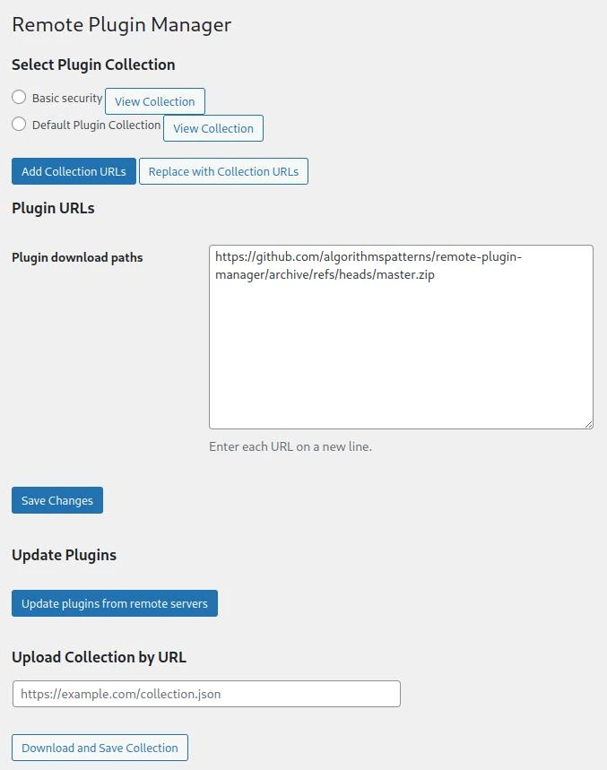

# Remote Plugin Manager

**Remote Plugin Manager** is a WordPress plugin that allows you to easily install and update plugins from external servers. This plugin is designed to streamline plugin management by supporting multiple paths for plugin updates, making it ideal for developers and advanced users.

## Features

- Add multiple external paths for plugin downloads
- Save paths in the database for easy access
- Automatically check and update plugins from external sources
- Simplified plugin management workflow

## Plugin Name and Description in Different Languages

- **English**: Remote Plugin Manager - A plugin for managing and updating WordPress plugins from external servers.
- **Русский**: Менеджер удалённых плагинов - Плагин для управления и обновления плагинов WordPress с внешних серверов.
- **Français**: Gestionnaire de plugins à distance - Un plugin pour gérer et mettre à jour les plugins WordPress depuis des serveurs externes.
- **Español**: Gestor de Plugins Remotos - Un plugin para gestionar y actualizar plugins de WordPress desde servidores externos.
- **Deutsch**: Remote-Plugin-Manager - Ein Plugin zur Verwaltung und Aktualisierung von WordPress-Plugins von externen Servern.
- **Latina**: Procurator Pluginum Remotorum - Pluginum ad moderandos et renovandos plugins WordPress ex serveris externis.
- **Italiano**: Gestore di Plugin Remoti - Un plugin per gestire e aggiornare i plugin di WordPress da server esterni.
- **Português**: Gerenciador de Plugins Remotos - Um plugin para gerenciar e atualizar plugins do WordPress a partir de servidores externos.
- **中文 (Simplified Chinese)**: 远程插件管理器 - 一个用于从外部服务器管理和更新WordPress插件的插件。
- **日本語 (Japanese)**: リモートプラグインマネージャー - 外部サーバーからWordPressプラグインを管理および更新するためのプラグインです。
- **한국어 (Korean)**: 원격 플러그인 관리자 - 외부 서버에서 WordPress 플러그인을 관리하고 업데이트하는 플러그인입니다.
- **العربية (Arabic)**: مدير الإضافات عن بُعد - مكون إضافي لإدارة وتحديث إضافات ووردبريس من الخوادم الخارجية.

## Available Languages

- **English**: Fully translated for easy usage by the global community.
- **Русский**: Плагин переведён на русский язык для удобства использования в России и странах СНГ.
- **Français**: Le plugin est traduit en français pour une utilisation facile dans les pays francophones.
- **Español**: El plugin está traducido al español para facilitar su uso en los países de habla hispana.
- **Deutsch**: Das Plugin wurde ins Deutsche übersetzt, um die Nutzung im deutschsprachigen Raum zu erleichtern.
- **Latina**: Pluginum in linguam Latinam conversum est ad usum latine loquentium.
- **Italiano**: Il plugin è stato tradotto in italiano per facilitare l'uso nei paesi di lingua italiana.
- **Português**: O plugin foi traduzido para português para facilitar o uso em países de língua portuguesa.
- **中文 (Simplified Chinese)**: 插件已翻译为简体中文，以方便中国用户使用。
- **日本語 (Japanese)**: このプラグインは日本語に翻訳されており、日本のユーザーが簡単に使用できるようになっています。
- **한국어 (Korean)**: 이 플러그인은 한국어로 번역되어 한국 사용자들이 쉽게 사용할 수 있습니다.
- **العربية (Arabic)**: تم ترجمة هذه الإضافة إلى اللغة العربية لتسهيل استخدامها في الدول الناطقة بالعربية.

## Installation

1. Download the package from the following link:  
   [Download Remote Plugin Manager](https://github.com/algorithmspatterns/remote-plugin-manager/archive/refs/heads/master.zip)
2. Upload it to your WordPress installation.
3. Activate the plugin and start managing your plugins with ease!

## Screenshot

Here is a quick look at the plugin in action:

## Support

If you'd like to support the development of this plugin, you can [buy me a coffee](https://buymeacoffee.com/kriachko)!
